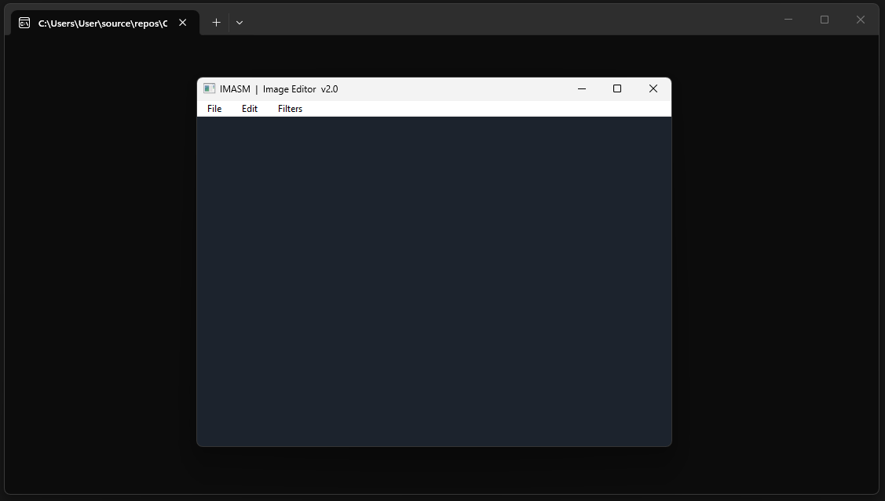
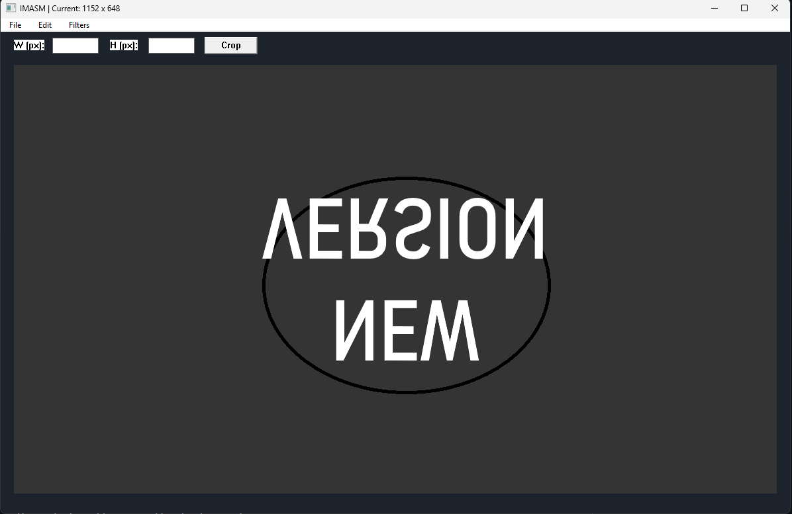

# IMASM Image Editor

IMASM is a high-performance image processing suite written in **x86 Assembly**. The application leverages the Win32 API and the Irvine32 library to perform direct memory manipulation on **24-bit Bitmap files**. By interacting directly with the CPU and system RAM, the editor applies complex visual filters and structural transformations with minimal overhead.

## Project Overview
The core objective of this project is to demonstrate the power of low-level programming in the context of computer graphics. Unlike high-level editors, IMASM handles pixel data through raw memory offsets and manual heap management, providing a transparent view of how image data is stored and mutated at the machine level.

## Technical Stack
* **Language:** x86 Assembly (MASM)
* **Libraries:** Irvine32, Win32 API (User32, GDI32, ComDlg32, Kernel32)
* **Architecture:** 32-bit (x86)
* **Format Support:** 24-bit Uncompressed BMP

## Main Interface

    

## Key Features

### Structural Edits
* **Dynamic Window Resizing:** The GUI automatically adjusts its dimensions to fit the aspect ratio of the loaded image using the `AdjustWindowRect` API.
* **Manual Cropping:** Precise pixel-based cropping via an integrated UI toolbar that reallocates heap memory and patches the BMP header in real-time.
* **Flipping:** In-place memory swapping for both Horizontal and Vertical mirroring without additional RAM allocation.

### Image Processing Filters
* **Sepia Tone:** Advanced matrix multiplication tinted for a vintage aesthetic.
* **Grayscale:** Luminance calculation based on weighted averages of RGB channels.
* **Brightness Control:** Direct arithmetic incrementing/decrementing of color byte values with overflow clamping at 0 and 255.
* **Inversion:** Bitwise `NOT` operations performed on raw pixel data for high-speed color negation.

---

## Processing Examples

### Example 1: Vintage Transformation
**Operations:** Horizontal Flip, Sepia Tone, Darkness (-50)

| Before | After |
| :---: | :---: |
|  |  |

### Example 2: Structural and Tonal Edit
**Operations:** Vertical Flip, Grayscale, Crop

| Before | After |
| :---: | :---: |
|  |  |

---

## Crop Interface

    

## Implementation Details
The application utilizes several low-level concepts:
1. **Memory Mapping:** The entire file is loaded into a heap block, where pointers are established for the `BitmapFileHeader`, `BitmapInfoHeader`, and the raw Pixel Array.
2. **Row Padding Math:** Calculations to handle the 4-byte alignment requirement of BMP rows, ensuring transformation loops do not drift.
3. **Message Loop:** A custom Win32 message pump to handle GUI events, control rendering, and manage static control backgrounds.
4. **ASCII-to-Integer Parsing:** A custom manual procedure to convert UI text input into mathematical values for the crop engine.

## Prerequisites
* Visual Studio 2022 (with MASM build tools)
* Irvine32 Library components

To run the application, open the project in Visual Studio, ensure the Irvine library paths are correctly configured in the Project Properties, and build for the **x86** platform.
